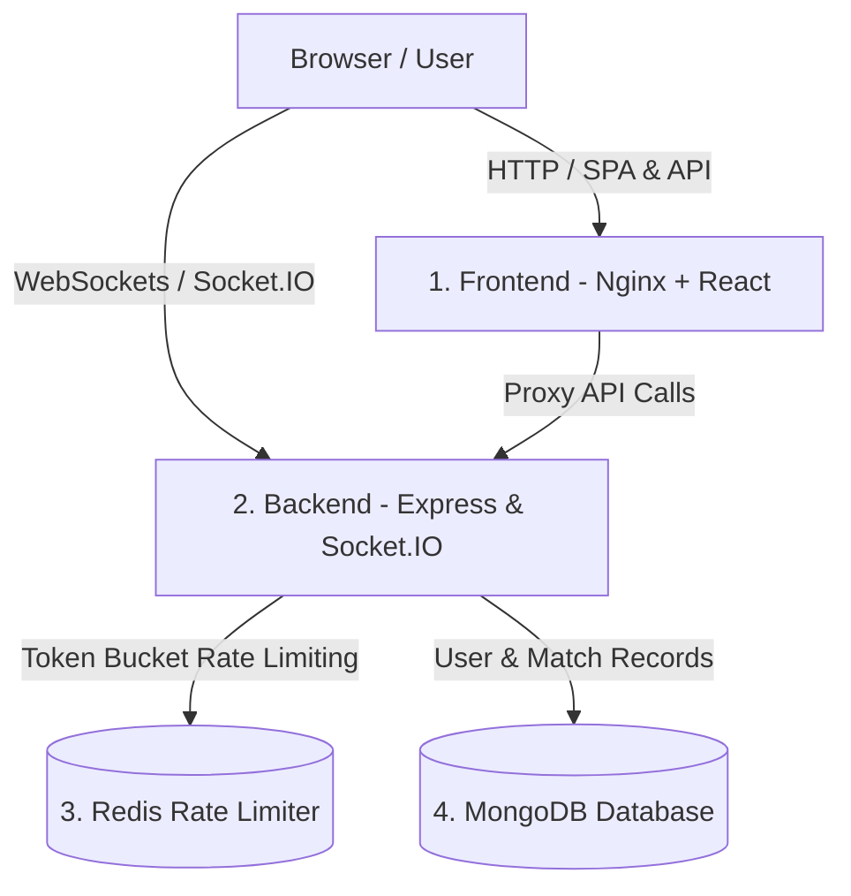

# ♟️ Chesso - Real-Time Multiplayer Chess

A production-ready, full-stack real-time multiplayer chess application orchestrated with **Docker Compose**, powered by **Redis-backed Rate Limiting**, and automated via a **GitHub Actions CI/CD** pipeline publishing multi-stage images to **GitHub Container Registry (GHCR)**.

---

## 🚀 Features

* ♟️ **Real-Time Multiplayer Gameplay**: Live move synchronization via Socket.IO.
* 🛡️ **Redis-Backed Rate Limiting**: Distributed brute-force and DDoS protection with graceful in-memory fallback.
* 🎵 **Web Audio Sound Effects**: Zero-latency native audio for moves, captures, checks, invalid moves, and victory/defeat.
* 🔒 **Smart Legal Move Validation**: Real-time illegal piece placement rejection, auto-snapback, legal move dots, and King-in-check indicators.
* ⏱️ **Live Chess Clock**: Synchronized countdown timers with automatic timeout winner declaration.
* 🏳️ **Resignation & Draw Handlers**: Support for checkmate, stalemate, threefold repetition, insufficient material, and resignation.
* 🔐 **Secure Authentication**: Google OAuth 2.0 & JWT-based authentication with persistent user profiles.
* 🐳 **Multi-Stage Dockerization**: Highly optimized, lightweight container images for frontend (Nginx Alpine) and backend (Node.js Alpine with non-root security).
* 🔄 **GitHub Actions CI/CD**: Automated linting, test suites, and Docker image publishing to GHCR.

---

## 🛠️ Tech Stack

### 💻 Core & Languages


### 🎨 Frontend


### ⚙️ Backend & Real-time


### 🗄️ Database & In-Memory Cache


### 🚢 DevOps & Containerization


---

## 🏗️ 4-Service Architecture



---

## 📂 Project Structure

```text
Chesso/
│
├── .github/
│   └── workflows/
│       └── ci-cd.yml          # GitHub Actions CI/CD Pipeline (GHCR publish)
│
├── frontend/
│   ├── src/                   # React components, pages, sounds & auth context
│   ├── nginx.conf             # Production Nginx SPA & reverse proxy config
│   ├── Dockerfile             # Multi-stage frontend Dockerfile (Node -> Nginx)
│   └── package.json
│
├── backend/
│   ├── middleware/            # Rate limiting (Redis) & JWT auth verification
│   ├── routes/                # Auth & user API routes
│   ├── Sockets/               # Socket.IO game management & timers
│   ├── utilites/              # Pure chess logic, Redis client, config
│   ├── tests/                 # Automated unit tests for rules & rate limiting
│   ├── Dockerfile             # Multi-stage backend Dockerfile (non-root)
│   ├── server.js              # Express entry point
│   └── package.json
│
├── docker-compose.yml         # 4-service stack orchestration
├── .env.example               # Root environment variables template
└── README.md
```

---

## 🐳 Quick Start with Docker Compose (Recommended)

Run the entire 4-service stack locally with a single command:

### 1. Clone the repository
```bash
git clone https://github.com/Algon31/Chesso.git
cd Chesso
```

### 2. Configure Environment
```bash
cp .env.example .env
```

### 3. Launch the Stack
```bash
docker compose up --build -d
```

| Service | URL / Port | Purpose |
| :--- | :--- | :--- |
| **Frontend** | [http://localhost:80](http://localhost:80) | Nginx serving React SPA |
| **Backend** | [http://localhost:3000](http://localhost:3000) | Express & Socket.IO API |
| **Redis** | `localhost:6379` | Rate limiting in-memory store |
| **MongoDB** | `localhost:27017` | Persistent database |

---

## 💻 Local Development Setup (Without Docker)

### 1. Backend Setup
```bash
cd backend
npm install
npm run dev
```

### 2. Frontend Setup
```bash
cd frontend
npm install
npm run dev
```

---

## 🧪 Testing & Validation

### Run Backend Unit Tests
Executes 8 automated tests covering chess rule enforcement (valid moves, illegal move rejections, checkmate, stalemate, insufficient material, promotion, timeouts, resignations, and Redis rate limiters):

```bash
cd backend
npm test
```

### Run Frontend Production Build
```bash
cd frontend
npm run build
```

---

## 🔄 GitHub Actions CI/CD Pipeline

The repository includes a GitHub Actions workflow (`.github/workflows/ci-cd.yml`):
1. **Automated Testing & Linting**: Spawns an ephemeral Redis service in GitHub Actions and runs both frontend build validation and backend unit test suites on every `push` and `pull_request`.
2. **Multi-Stage Docker Builds**: Builds optimized Docker images for frontend and backend with GitHub Actions cache backend (`type=gha`).
3. **GHCR Publishing**: Automatically tags and pushes images to **GitHub Container Registry (`ghcr.io`)** on every merge to `main`.

---

## 👨‍💻 Author

**Ravi Bhuvan**
* GitHub: [@Algon31](https://github.com/Algon31)
* LinkedIn: [Ravi Bhuvan](https://www.linkedin.com/in/ravi-bhuvan-985399286/)
